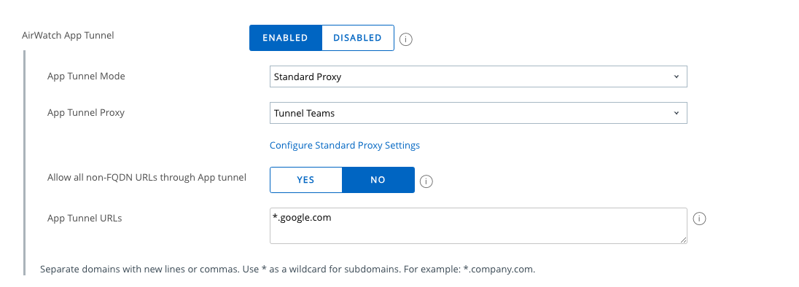
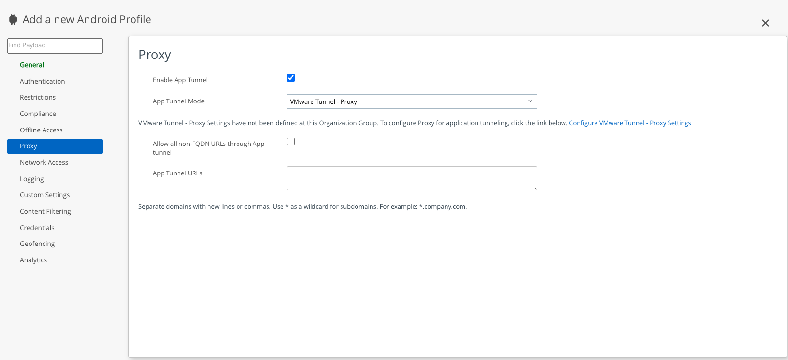
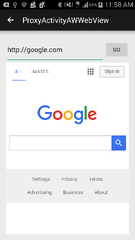

## Overview

The steps in this tutorial are done with the assumption that you have gone through the steps in [Getting Started](../getting-started.md) tutorial as well as Integrating the Client SDK portion in the [SDK Setup](../SDK-Setup.md) section.

## Requirements

- Android 8.0+ (i.e., API 26)
- Workspace ONE UEM Console 2302+
- Android Studio with the Gradle Android Build System (Gradle) 8.2.2+
- JDK version 17
- Workspace ONE Intelligent Hub for Android version 24.07
- Android Test Device
- AirWatch SDK from the Resources Portal

## Developer Considerations

In order to redirect your application’s traffic to an AirWatch supported proxy such as the Standard proxy within the Unified Access Gateway (UAG), you can use the following AirWatch networking classes:

- AWOkHttpClient
- AWWebView
- AWWebViewClient
- AWURLConnection

No additional logic is needed to handle the tunneling of a network request from your internal application. For more information refer [Networking Developer Guide](https://developer.omnissa.com/ws1-uem-sdk-for-android/guides/WS1AndroidDeveloperGuideNetworking.pdf)

## Tutorial

Proxy configuration with the AirWatch Android SDK is setup via the following steps:

1. Policy configuration – Tunnel profile is configured via the AirWatch Console.
2. Logic Implementation – Connect to an endpoint in your application using one of the supported networking classes
3. Assignment and Deployment – Configure the assignment and deployment rules for your organization’s devices.

### Policy Configuration

At this point in the tutorial, we assume you have already gone through the steps of uploading your app and assigning the wrapping profile mentioned in General Setup.

Log into the AirWatch Console and identify if the wrapping profile you assigned to your application is the default profile or a custom profile. If there is no profile assigned, you can choose from one of two ways to configure the policy: group-wide default settings or an ad-hoc custom profile.

#### Using the Default Profile (Recommended)

1. If the profile assigned is the default profile, then the policy settings can be edited by navigating to Apps & Books > All Apps & Books Settings > Apps > Settings And Policies > Security Policies.
settings


2. Enable the AirWatch App Tunnel option.
3. Set your App Tunnel Mode to the proxy you plan on using. (If there is no proxy configured, follow the configure proxy settings link on the UI to walk through setting up your proxy)
4. Click the Save button to persist any changes you have made.

!!!Note
    These changes will reflect via the Default Profile during profile assignment which will be done in a later step in the tutorial.

#### Using an Ad-hoc Custom Profile

1. Navigate to Apps & Books > All Apps & Books Settings > Apps > Settings And Policies > Profiles.
2. Select your assigned profile, or click on Add Profile and select the App Profile.
3. In the General section, assign a name to your profile.
4. Select the Proxy payload and Enable App Tunnel and set your App Tunnel Mode to the proxy you plan on using.
5. Click Save to create or update your app profile.


### Logic Implementation

In the provided sample tunnel app within the [integration samples repo](https://github.com/euc-releases/workspace-ONE-SDK-integration-samples/tree/main/IntegrationGuideForAndroid/Apps/tunnel), you will find an example implementation in the `ProxyTestActivity.java` class, as shown below.

```KOTLIN

package com.example.integrationguide

import android.content.Context
...

class ProxyTestActivity : SDKBaseActivity(), View.OnClickListener, StatusListener {
    private var mEditUrl: EditText? = null
    var mWebViewHolder: RelativeLayout? = null
    private var mAwWebView: TestWebView? = null
    private var context: Context? = null
    private val mGatewayManager: GatewayManager? = null
    private var imageView: ImageView? = null
    private val mTestComponentArray = arrayOf("AWWebView",
            "AWUrlConnection",
            "AWOkHttpClient")
    private var mTestComponentAdapter: ArrayAdapter<String>? = null
    private var mSpTestComponent: Spinner? = null
    private var mConnectionHandler: ConnectionHandler? = null


    private fun reset() {
        mEditUrl?.setText("")
        mEditUrl?.isEnabled = true
        mConnectionHandler = null
    }

    private val onItemSelectedListener: AdapterView.OnItemSelectedListener =
            object : AdapterView.OnItemSelectedListener {
        override fun onItemSelected(
                parent: AdapterView<*>?,
        view: View,
                position: Int,
                id: Long,
            ) {
            reset()
            when (position) {
                0 -> {
                    imageView?.visibility = View.GONE
                    mAwWebView?.visibility = View.VISIBLE
                    mConnectionHandler = AwWebViewConnectionHandler(mAwWebView)
                }
                1 -> mConnectionHandler = AwUrlConnectionHandler(this@ProxyTestActivity1)
                2 -> mConnectionHandler =
                        AwOkHttpClientConnectionHandler(this@ProxyTestActivity1)
                    else -> mTextStatus?.text = resources.getString(R.string.invalid_selection)
            }
        }

        override fun onNothingSelected(parent: AdapterView<*>?) {}
    }


    override fun onCreate(arg0: Bundle?) {
        super.onCreate(arg0)
        setContentView(R.layout.proxy_activity)
        context = this
        initViews()
        if (isTunnellingEnabled) {
            setupProxy()
        }
        updateUiState()
    }

    private val isTunnellingEnabled: Boolean
        private get() = SDKContextManager.getSDKContext().sdkConfiguration.getBooleanValue(
            SDKConfigurationKeys.TYPE_APP_TUNNELING,
            SDKConfigurationKeys.ENABLE_APP_TUNNEL)

    /**
     * this is where we start the proxy manager that handle the proxy setup.
     */
    private fun setupProxy() {
        try {
            val gatewayManager = GatewayManager.getInstance(applicationContext)
            if (!gatewayManager.isRunning) {
                launchRingDialog()
            } else {
                mTextStatus?.text = resources.getString(R.string.proxy_started)
            }
            gatewayManager.registerGatewayStatusListener(ProxyListener())
            gatewayManager.autoConfigureProxy()
        } catch (e: GatewayException) {
            e(TAG, "Getting exception while creating proxy " + e.message)
        }
    }

    private fun initViews() {
        mAwWebView = findViewById<View>(R.id.act_main_test_result_wv) as TestWebView
                mWebViewHolder = findViewById<View>(R.id.lyt_webview_holder) as RelativeLayout
        if (mWebViewHolder?.findViewById<View?>(R.id.act_main_test_result_wv) == null) {
            mWebViewHolder?.addView(mAwWebView)
        }
        findViewById<View>(R.id.act_main_start_test_btn).setOnClickListener(this)
        imageView = findViewById(R.id.imageView)
        mEditUrl = findViewById<View>(R.id.url_edit_text) as EditText
        mEditUrl?.setText("")
        mSpTestComponent = findViewById<View>(R.id.act_main_test_component_sp) as Spinner
        setupSpinners()
    }

    private fun setupSpinners() {
        mTestComponentAdapter = ArrayAdapter(applicationContext,
                android.R.layout.simple_spinner_item,
                mTestComponentArray)
        mTestComponentAdapter?.setDropDownViewResource(android.R.layout.simple_spinner_item)
        mSpTestComponent?.adapter = mTestComponentAdapter
        mSpTestComponent?.onItemSelectedListener = onItemSelectedListener
    }

    override fun onClick(v: View) {
        when (v.id) {
            R.id.act_main_start_test_btn -> {
                if (TextUtils.isEmpty(mEditUrl?.text)) {
                    Toast.makeText(this, "Please Enter URL", Toast.LENGTH_LONG).show()
                    return
                }
                var loadUrl = mEditUrl?.text.toString()
                if (!loadUrl.startsWith("http://") && !loadUrl.startsWith("https://")) {
                    loadUrl = "http://$loadUrl"
                    mEditUrl?.setText(loadUrl)
                }
                mConnectionHandler?.connect(loadUrl)
            }
            else -> {
            }
        }
    }

    override fun onDestroy() {
        try {
            mGatewayManager?.stop()
        } catch (e: GatewayException) {
            e.printStackTrace()
        }
        super.onDestroy()
    }

    inner class ProxyListener : IGatewayStatusListener {
        override fun onError(errorCode: Int) {
            d(TAG, "Airwatch::reportError() - errorCode -$ErrorCode")

            runOnUiThread {
                updateUiState()
            }
        }

        override fun onStatusChange(gatewayStatus: Int) {
            when (gatewayStatus) {
                GatewayStatusCodes.STATE_CONFIGURING, GatewayStatusCodes.STATE_ESTABLISHING_CONNECTION -> d(
                        TAG,
                        "Airwatch::onProxyStateChange() state-$gatewayStatus")
                GatewayStatusCodes.STATE_STARTED -> onProxyStartComplete()
                GatewayStatusCodes.STATE_STOPPED -> onProxyStopComplete()
                else -> {
                }
            }
        }

        private fun onProxyStartComplete() {
            Log.i(TAG, "onProxyStartComplete")
            Log.i(TAG, "isSuccess")

            runOnUiThread {
                mProgressDialog?.dismiss()
                mTextStatus?.text = resources.getString(R.string.proxy_started)
                updateUiState()
            }
        }

        private fun onProxyStopComplete() {
            d(TAG, "Airwatch::onProxyStopComplete()")
        }
    }


    //region StatusListener

    override fun onStatusUpdate(status: String) {
        runOnUiThread {
            mTextStatus?.text = status
        }
    }

    //endregion StatusListener


    companion object {
        private val TAG = ProxyTestActivity.javaClass.simpleName
    }

    private fun getProxyType(type: ProxySetupType): String{
        return when(type){
            ProxySetupType.TUNNEL -> "Workspace ONE Tunnel"
            ProxySetupType.PACV2 -> "Workspace ONE PACV2"
            else -> "Workspace ONE Default"
        }
        return type.toString()
    }

    private fun updateUiState(){
        runOnUiThread{
            val proxyState = if (isTunnellingEnabled) R.string.enabled else R.string.disabled
            findViewById<EditText>(R.id.proxy_state).setText(resources.getString(proxyState))
            val gatewayManager = GatewayManager.getInstance(applicationContext)

            findViewById<EditText>(R.id.proxy_type).setText(getProxyType(GatewayConfigManager.init(applicationContext).appTunnelType))
        }
    }

}
```

The above mentioned ProxyTestActivity demonstrates the usage of AWOkHttpClient, AWWebView and more. Given below are few examples of connection Handlers.

#### AWOKHttpClient

`AWOKHttpClient` is a class available to provide the tunneling and SSO (integrated authentication) features, depending on your business use case.

Implementing the `AWOKHttpClient` is identical to the way you may implement any HTTPClient. You would instantiate a client and an http request, following by executing the client on a specified endpoint URL.

#### Set up the AwOkHttpClient

You will find the AwOkHttpClientConnectionHandler for `AwOkHttpClient`  tunnel sample app within the [integration samples repo](https://github.com/euc-releases/workspace-ONE-SDK-integration-samples/tree/main/IntegrationGuideForAndroid/Apps/tunnel) for this module.

```KOTLIN
package com.example.integrationguide.nw

import com.airwatch.gateway.clients.AWOkHttpClient
import com.airwatch.util.Logger.e
import com.airwatch.util.Logger.i
import com.example.integrationguide.interfaces.ConnectionHandler
import com.example.integrationguide.interfaces.StatusListener
import okhttp3.OkHttpClient
import okhttp3.Request
import java.lang.ref.WeakReference

class AwOkHttpClientConnectionHandler(listener: StatusListener? = null) : ConnectionHandler {

    private var listener: WeakReference<StatusListener> = WeakReference(listener)

    companion object {
        private val TAG: String = AwOkHttpClientConnectionHandler::class.java.name
    }

    override fun connect(url: String) {
        loadUrlInAwOkHttpClient(url, listener.get())
    }

    private fun loadUrlInAwOkHttpClient(loadUrl: String, listener: StatusListener?) {
        Thread {
            try {
                val client = OkHttpClient()
                val request: Request = Request.Builder()
                    .url(loadUrl)
                    .build()
                val response = AWOkHttpClient.newCall(client, request).execute()
                val status = "AWOkHttpClient : ${response.code}"
                listener?.onStatusUpdate(status)
                i(TAG, status)
                response.body?.let {
                    i(TAG, status)
                    it.close()
                }
            } catch (e: Exception) {
                val status = "Unable to send request AWOkHttpClient ${e.message}"
                listener?.onStatusUpdate(status)
                e(TAG, status)
            }
        }.start()
    }
}
```

#### AWWebView and AWWebViewClient
 
`AWWebView` and `AWWebViewClient` are subclasses of `WebView` and `WebViewClient`, respectively. They can be used in much the same way as their parent classes.

##### Set up the AWWebView and AWWebViewClient

The approach taken in the tunnel app was to create an `AWWebView` class, in order to include the url loading logic and set it’s `WebViewClient`.

You will find the AwWebViewConnectionHandler for `AWWebView`  tunnel sample app within the [integration samples repo](https://github.com/euc-releases/workspace-ONE-SDK-integration-samples/tree/main/IntegrationGuideForAndroid/Apps/tunnel) for this module.

```KOTLIN
package com.example.integrationguide.nw

import android.webkit.WebView
import com.example.integrationguide.interfaces.ConnectionHandler
import com.example.integrationguide.interfaces.StatusListener
import java.lang.ref.WeakReference

class AwWebViewConnectionHandler(view: WebView?, listener: StatusListener? = null) :
    ConnectionHandler {

    private var webView: WeakReference<WebView> = WeakReference(view)
    private var listener: WeakReference<StatusListener> = WeakReference(listener)

    override fun connect(url: String) {
        loadUrlInAwWebView(url)
    }

    private fun loadUrlInAwWebView(loadUrl: String) {
        webView.get()?.loadUrl(loadUrl)
        listener.get()?.onStatusUpdate("URL loaded")
    }
}
```

Your sample web view should appear like the figure below:


### Assignment and Deployment

The last step is to assign who should get the app and when.

1. Click Add Assignment.
2. Select or create a smart group with your desired set of device assignments.
3. Configure the push mode and deployment time if applicable.
4. Add the assignment.
5. Once ready, click Save and Publish to start the wrapping and deployment process.
