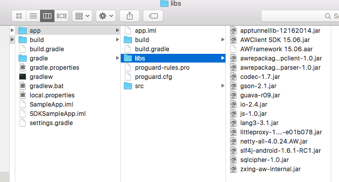
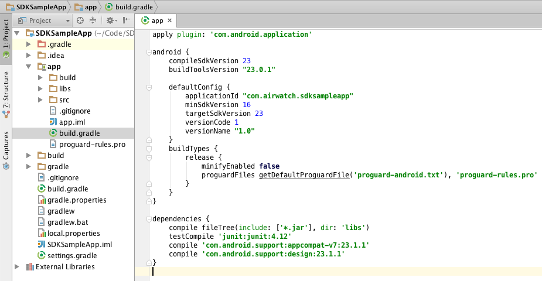

## Overview

The steps in this tutorial are NOT required if you are using App Wrapping or using only approaches from AppConfig.org. This tutorial will walk developers through how to setup the core SDK framework for those who have chosen the SDK approach.

Before moving forward to the SDK setup tutorial, ensure you have completed the instructions in the [General Setup tutorial](index.md) and uploaded your app with an assigned SDK profile.

!!!Important
    You will need to download the SDK binary separately via [resources.air-watch.com](https://resources.air-watch.com/). Please contact your AirWatch representative or support to gain access.

## Requirements

- Android 4.0+ / Ice Cream Sandwich / API Level 14+
- Android Studio with the Gradle v1.3.0+
- Android Test Device
- AirWatch SDK from the Resources Portal
- AirWatch Agent v5.3+ for Android (Requirement be lower depending on features used)

## Tutorial

There are two components in the Android SDK:

- Client SDK – This is a lightweight JAR file which contains a basic level of functionality.
- `AWFramework` – This is a more advanced AAR file which contains the logic for features such as app tunneling and integrated authentication. Integrating AWFramework also requires integration of the Client SDK.

Refer to the SDK implementation guide included in your SDK package for more details on what is in the Client SDK vs. the AWFramework.

## Integrating the Client SDK

### Adding the required JAR files

Add the AirWatchSDK.jar and gson.jar to the libs folder in your project folder structure. These files are located in your downloaded SDK package from the AirWatch resource portal. 

2. Ensure that these libs are part of your build.gradle. Within the dependencies section in your gradle file you should see something similar to this:

```
dependencies {
    compile fileTree(include: ['*.jar'], dir: 'libs')
}
```



### Initialize the Client SDK

1. The entry point to the Client SDK is done throughSDKManager.
2. Start by creating an instance of SDKManager and call init.

```
new Thread(new Runnable() {
    public void run() {
    try {
            awSDKManager = SDKManager.init(getApplicationContext());
        } catch (AirWatchSDKException e) {
            Log.e(TAG, "Error: ", e);
        }
    }
}).start();
```

3. If no exceptions are returned, then the Client SDK was successfully initialized.
4. Next, move on to the next section to integrate the AWFramework.

## Integrating the AWFramework and the Login Flow

### Importing the libraries

In your project file directory, ensure the listed files are in the libs folder as listed below. Find these files in the dependencies folder in the AirWatch SDK zip file:

- AirWatch Client SDK.jar
- gson.jar
- AWFramework aar
- apptunnellib-12162014.jar
- awrepackagedhttpclient-1.0.jar
- awrepackagedrhinopacparser-1.0.jar
- codec-1.7.jar
- io-2.4.jar
- lang3-3.3.1.jar
- guava-r09.jar
- js-1.0.jar
- littleproxy-1.1.0-beta1-e01b078.jar
- netty-all-4.0.24.AW.jar
- slf4j-android-1.6.1-RC1.jar
- sqlcipher-1.0.jar
- zxing-aw-internal.jar

### Setting up Gradle

Add the dependencies in your app-level Gradle build file.

1. Add a repositories block.
repositories{
	flatDir{
		dirs 'libs'
	}
}
```

2. Add the files to the dependencies section, ensuring to change the names to match the names and versions of the library files.

```
dependencies {
	compile fileTree(dir: 'libs', include: ['*.jar'])
	compile (name: 'AWFramework 15.11',ext:'aar')
	compile 'com.android.support:appcompat-v7:22.2.1'
}
```

1. Add a packagingOptions block with the following exclusions: packagingOptions { exclude 'META-INF/LICENSE.txt' exclude 'META-INF/NOTICE.txt' }
1. Run the proguard.cfg file provided with the SDK package for your release builds. In order to do this, modify the release block in the buildTypes section of your Gradle file to include the excerpt.

!!!Note
    Ensure to include the proguard.cfg file in the same folder as your gradle file. Find the proguard.cfg file inside the folder or package in which your SDK was delivered.

```
buildTypes {
	release {
		signingConfig signingConfigs.release
		minifyEnabled true
		proguardFiles file('proguard.cfg')
	}
}
```

The package resembles the following example:

```C
apply plugin: 'com.android.application'

android {
    compileSdkVersion 23
    buildToolsVersion "24.0.3"
    defaultConfig {
        applicationId "com.airwatch.sdksample"
        minSdkVersion 19
        targetSdkVersion 23
        versionCode 1
        versionName "1.0"
        testInstrumentationRunner "android.support.test.runner.AndroidJUnitRunner"
        multiDexEnabled true
    }
    buildTypes {
        release {
            minifyEnabled true
            proguardFiles file('proguard.cfg')
        }
    }

    dexOptions {
        jumboMode = true
        preDexLibraries false
        javaMaxHeapSize "4g"
    }

    repositories{
        flatDir{
            dirs 'libs'
        }
    }

    packagingOptions {
        exclude 'META-INF/LICENSE.txt'
        exclude 'META-INF/NOTICE.txt'
    }
}

dependencies {
    compile fileTree(dir: 'libs', include: ['*.jar'])
    compile 'com.android.support:appcompat-v7:23.1.1'
    compile 'com.android.support:multidex:1.0.1'
    compile 'com.android.support:design:23.1.1'
    compile 'com.android.support:support-v13:23.1.1'
    compile (name: 'AWFramework 16.X', ext: 'aar')
    compile (name: 'sqlcipher-3.5.2-2', ext: 'aar')

    testCompile 'junit:junit:4.12'

    androidTestCompile('com.android.support.test.espresso:espresso-core:2.2.2', {
        exclude group: 'com.android.support', module: 'support-annotations'
    })
}
```

Sync Gradle after adding the configurations.

### Create an Application class for AWFramework

1. Create a new Java class with a name appropriate for the Application. E.g. SDKApplication
2. Subclass the SDKApplication class from AWApplication:
`public class SDKWalkthroughApp extends AWApplication`
3. Implement getMainActivityIntent() so that control can be returned to the Main Activity once the sdk initialization has been completed.
4. Implement getMainLauncherIntent() in the application so that the SDK knows which Acitivity to give control to during initialization. In this walkthrough, we’re using GatewaySplashActivity. This gives us the functionality from the Login Flow and the initialization of the GatewayManager for tunneling and local authentication.
5. Override getMagCertificateEnable() so that the app can fetch the Mag Certificate during SDK initialization as well.

The Application class should represent the below sample:

```C
package com.sample.airwatchsdk;

import android.content.Intent;

import com.airwatch.app.AWApplication;


public class SDKSampleApp extends AWApplication {

    @Override
    public Intent getMainActivityIntent() {
        return new Intent(getApplicationContext(), MainActivity.class);
    }

    /**
     * This method should be override if your application supports fetch mag certificate during
     login process.
     *
     * @return true if app supports fetch mag certificate.
     */
    @Override
    public boolean getMagCertificateEnable() {
        return true;
    }

    /**
     * get if the application is allowed in the standalone mode without
     * the dependency to Anchor Application
     * @return
     */
    @Override
    public boolean getIsStandAloneAllowed() {
        return false;
    }
}
```

#### Setting Up the Manifest

1. Declare a Content Provider. Make sure to add your App’s package to the authorities tag

```xml
provider
	android:authorities="<your app package name>.securepreferences"
	android:name="com.airwatch.storage.PreferencesProvider"
	android:exported="false"/>
```

1. Add the following permissions to the manifest

```xml
<uses-permission android:name="android.permission.INTERNET" />
<uses-permission android:name="com.airwatch.sdk.BROADCAST" />
<uses-permission android:name="android.permission.ACCESS_NETWORK_STATE" />
<uses-permission android:name="android.permission.CAMERA" />
<uses-permission android:name="android.permission.VIBRATE" />
<uses-permission android:name="android.permission.WRITE_EXTERNAL_STORAGE" />
<uses-permission android:name="android.permission.READ_PHONE_STATE" />
<uses-permission android:name="android.permission.READ_EXTERNAL_STORAGE" />
```

1. Set the GatewaySplashActivity as the Main launcher activity. Notice that the MainActivity is no longer listed as the Main launcher activity.

```xml
        <activity
            android:name="com.airwatch.login.ui.activity.SDKSplashActivity"
            <intent-filter>
                <action android:name="android.intent.action.MAIN" />

                <category android:name="android.intent.category.LAUNCHER" />
            </intent-filter>
        </activity>
        <activity
            android:name=".MainActivity"
            android:label="@string/app_name" >
        </activity>
```

1. The manifest resembles the following example:

```xml
<uses-permission android:name="android.permission.INTERNET" />
<uses-permission android:name="com.airwatch.sdk.BROADCAST" />
<uses-permission android:name="android.permission.ACCESS_NETWORK_STATE" />
<uses-permission android:name="android.permission.CAMERA" />
<uses-permission android:name="android.permission.VIBRATE" />
<uses-permission android:name="android.permission.WRITE_EXTERNAL_STORAGE" />
<uses-permission android:name="android.permission.READ_PHONE_STATE" />
<uses-permission android:name="android.permission.READ_EXTERNAL_STORAGE" />

<application
        android:name=".AWSDKSampleApp"
        android:allowBackup="true"
        android:icon="@mipmap/ic_launcher"
        android:label="@string/app_name"
        android:theme="@style/AppTheme" >

        <provider
            android:name="com.airwatch.storage.PreferencesProvider"
            android:authorities="com.airwatch.sdksampleapp.securepreferences"
            android:exported="false" />

        <activity
            android:name="com.airwatch.login.ui.activity.SDKSplashActivity"
            <intent-filter>
                <action android:name="android.intent.action.MAIN" />

                <category android:name="android.intent.category.LAUNCHER" />
            </intent-filter>
        </activity>
        <activity
            android:name=".MainActivity"
            android:label="@string/app_name" >
        </activity>
        <activity
            android:name=".BaseSDKActivity"
            android:label="@string/title_activity_base_sdk" >
        </activity>
    </application>
```

#### Configure the App theme to have the Branding Icon

1. Set the SDK Branding Icon to be the image. This can be the app icon or an image specific to the app. The Branding Icon is required for SDK Login Flow integrations.

```xml
<!-- Base application theme. -->
<style name="AppTheme" parent="Theme.AppCompat.Light.DarkActionBar">
<!-- Customize your theme here. -->
<item name="colorPrimary">@color/colorPrimary</item>
<item name="colorPrimaryDark">@color/colorPrimaryDark</item>
<item name="colorAccent">@color/colorAccent</item>
<!-- Add a link to the app icon for the SDK Splash screen -->
<item name="sdkBrandingIcon">@mipmap/ic_launcher</item>
</style>
```

#### Configure the Main Activity to handle the AirWatch SDK Login Flow/GatewayManager setup

`public class MainActivity extends SDKBaseActivity`
    
Subclass the MainActivity to inherit from `SDKBaseActivity`.

#### Debug Your Application

Before you can begin using the SDK API, you must ensure your application signing key is whitelisted with your AirWatch Admin Console. There are a few ways to do this depending on your deployment scenario.

#### Internal Deployment or Testing

1. Sign an APK file with the debug keystore of Android Studio. This is located in ~/.android/debug.keystore by default.

1. Upload the APK file signed with your debug key to the AirWatch Admin Console. (Refer back to the Uploading your application in the Getting Started section.)

1. Install the application through the AirWatch Agent app. This can be done by pushing the app down using the Agent‘s app catalog. If you set your installation policy to Automatic then the app will install automatically.

1. Once the app is listed in the Managed Apps section of the Agent, it is ready for local management and can then be sideloaded manually through your IDE (Android Studio).

#### Play Store Deployment

For applications that are deployed publicly through the Play Store, send the public signing key of the application to AirWatch for whitelisting.

!!!Note
    Contact your professional services representative for the process of whitelisting the public signing key.

#### Next Steps

Once the SDK setup is completed, move on to the next SDK sections to implement the feature specific logic.