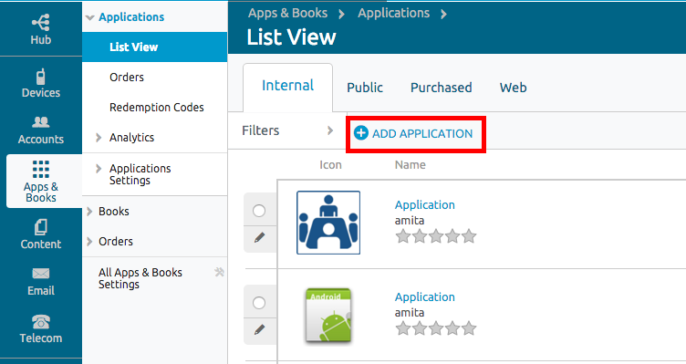
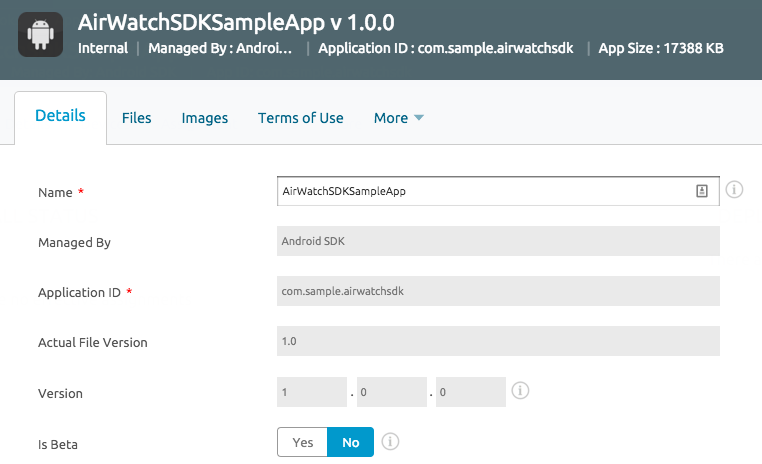
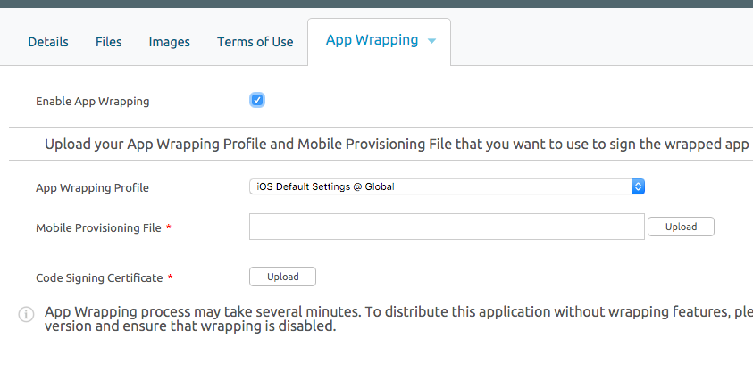

## Overview

If you haven’t already, please review the [Features Available](../../dev-centre/ws1/core-capabilities.md) and [Comparison of Technical Approaches](../../dev-centre/ws1/core-capabilities.md#technical-capabilities) sections to help determine the best technical approach (AppConfig.org, AirWatch SDK, App Wrapping) for your use case.

After you’ve been acquainted with the different options of integration with AirWatch, decide on a technical approach which best meets your use cases.

## Setting up your Test Environment

To begin testing, you’ll need to have access to an AirWatch Admin Console with permission to upload the app as well as user credentials to enroll your device into AirWatch.

There are several ways to enroll your device, a most common way is to do so via the AirWatch Agent using an email address or a server URL / group id combination:

1. Navigate to the Play Store or App Store and install the AirWatch Agent.
2. Open up the Agent and select the server details option.
3. Enter the server url – This is usually the same URL as your admin console, but can be different depending on your infrastructure.
4. Enter in the group id for your organization group
5. Continue to the next step and enter in your enrollment user credentials.
6. Go through and accept the device administration and profile installation prompts until enrollment is completed.

!!! note ""
    During the debugging and testing process, the application must first be uploaded to your AirWatch Admin Console and pushed down to your test device for your first installation. Every subsequent test can be side-loaded directly from your IDE.

## Uploading your application

Before you can start to test or debug using AppConfig, AirWatch SDK, or App Wrapping, you will need to upload your app to the AirWatch Admin console in order to register your app. These are the steps for how to do so:

### Adding a Local File

1. Navigate to Apps & Books > Applications > List View > Internal and select Add Application. 

2. Select Upload and  Local File to browse for the application file on your system.
3. Select Continue and configure the Details tab options. Not every option is supported for every platform.
   For fulls details on the different options in this tab, see our [Mobile Application Management (MAM) Guide](https://resources.air-watch.com/view/3e6301000a0028c197fb/en)  

If you are attempting to leverage App Wrapping, there is an additional set of instructions you will need to follow in [App Wrapping](#configuration-for-app-wrapping) section below. Likewise, if you are attempting to use the AirWatch SDK, please read and follow the [SDK integration](#configuration-for-sdk-apps) section below.

If you do not plan on using the SDK or app wrapping, skip directly to the [Save Your App](#save-your-app) section.

### Configuration for App Wrapping

This steps in this section only are only required if you are using application wrapping.

1. You must enable App Wrapping during the upload and setup of your mobile app. Go to More > App Wrapping and click on Enable App Wrapping.

2. After enabling wrapping, you can then create and set the app wrapping profile on the same screen shown above. There are two choices for setting an app wrapping profile, you can use the default settings profile or you can create an Ad-Hoc custom profile, select the default settings for now.
3. Move to the [Save Your App](#save-your-app) section.

### Configuration for SDK Apps

This steps in this section only are only required if you plan on integrating the AirWatch SDK.

1. You must enable SDK during the upload and setup of your mobile app. Go to More > SDK.

2. Set the SDK profile to the default settings for now. (You can change it later if you need custom created profiles)
3. Leave the Application Profile empty.
4. Move to the [Save Your App](#save-your-app) section.

### Save Your App

1. Once you have finished the appropriate steps above, click Save & Assign.
2. Click on Add Assignment and select a smart group containing your test device. (Create a smartgroup if none are created)
3. Finish up by clicking add and Save & Publish to add your app to the AirWatch portal.

### Next Steps

1. If you are using AppConfig or Wrapping, skip to the features section and begin following the implementation steps for your specific use case.
2. If you are using the SDK, first complete the [SDK Setup](SDK-Setup.md) section under getting started to integrate the core SDK framework.
